# Side Scrolling Game Prototype

## About

The primary objective is to develop a single-level side-scrolling game prototype inspired by classic Mario games using pure ReactJs and explore the feasibility of modern web technologies in game development. This project aims to demonstrate core game mechanics such as player movement, camera scrolling, coin collection and game over.  

## Technologies

CSS grid:​
Game layout​

ReactJs:​
Manage Enity

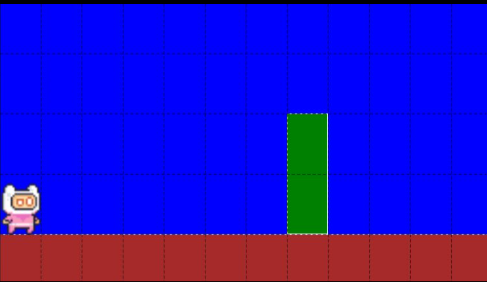  
Everything has a position, for example
the the player is at column 1, row 8 and
the first pipe location is column 7, row 8.​

 

## Key Featurs

-Player movement, jump and fall 

-Camera scroll​ 

-Collision detection ​ 

-Coin collision​ 

-Game over  

## Entities

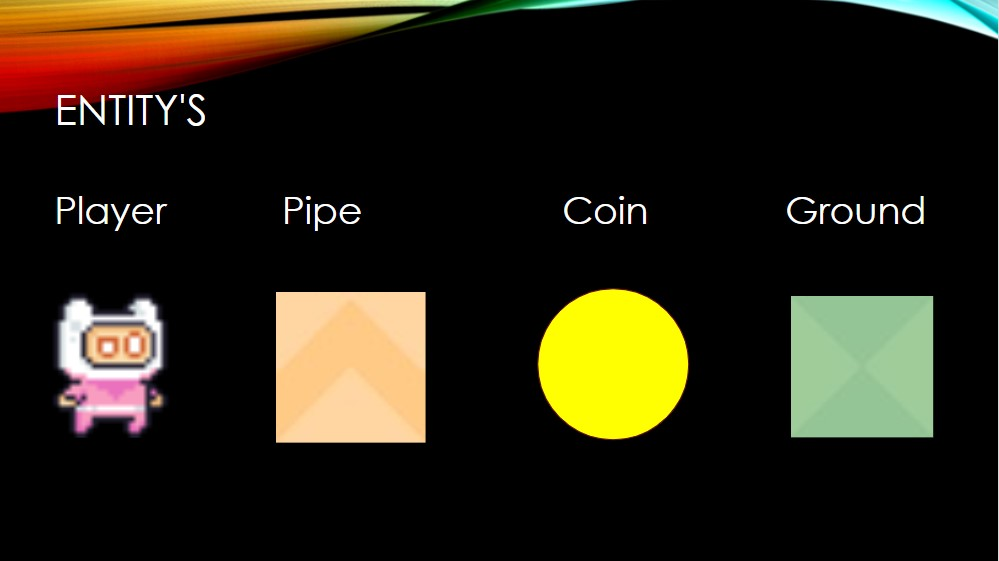 

## Design and Architecture

As seen below the game consists of three layers, the presentation layer, entity layer and logic controller layer that can be seen as the Input layer.

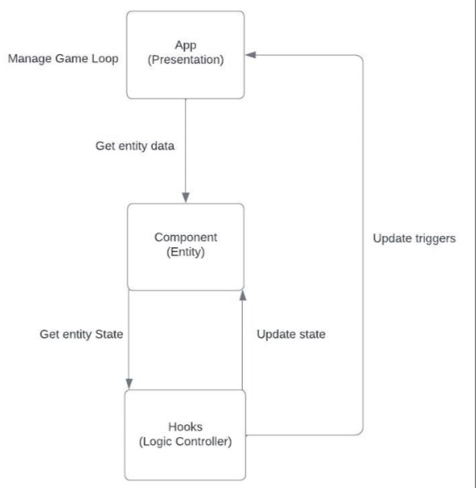 
Presentation Layer:
This layer manages the rendering of entities and elements within the game.
Entity:
This layer manages objects within the game such as the player, coin, and pipe.
Logic controller layer:
This layer handles the player inputs and game logic.

As seen in the diagram above, there is also a link between the presentation layer and the logic controller layer, this is due to the design of react and can not be removed as the presentation is tightly coupled with the controller layer by default. This being the case we did try our best to work around the limitations of react and resulted in the design pattern we have now.
The game is developed using components for entities, hooks for game logic, and a CSS Grid for the layout.

## Camera Scroll Diagram

The camera scroll consists of three main components, the camera, the overflowing x-axis and the overflow itself.

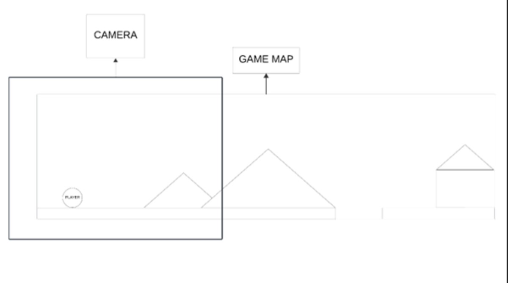  
Camera:
Above you can see a box representing the camera, this area is visible to the user and is the area that they will interact with the game world in.
Game map:
The game map is the game world it’s self that houses all objects and entities
Overflow:
This can be seen as the attribute that connects both plains. The game map that overflows outside of the camera area we set to hidden to hide it from the user. The second value we set to the overflow is that we make the x-axis scrollable to true, is allows us to pan left and right as the play moves in the game world.

## Output

1. **Player movement**:  
   The game is built on a CSS grid where we allocate a position on the grid for the player. When a player moves forward or back, we add 1 or take one away, to allow the player to move forward one grid cell or back one grid cell.  The player movement controller takes an event argument which checks what type of event occurred, in this case, we check for the left, right, and up arrow keys. These keys will be used for player movement. From here we set the player's position and return it to update the player object position as seen below in the code sample.
   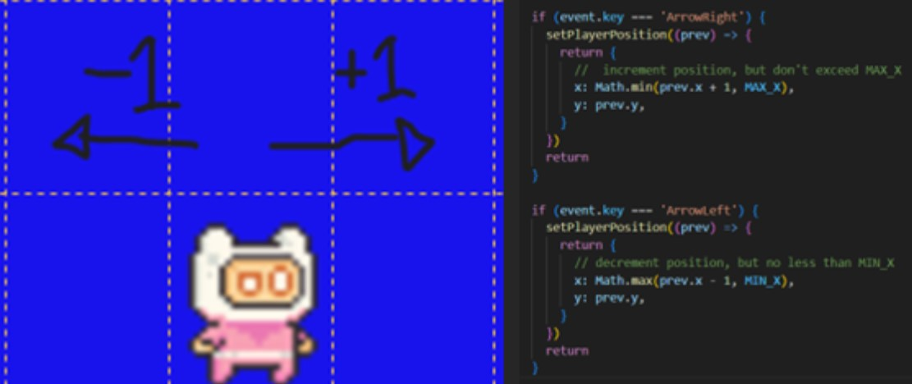 
   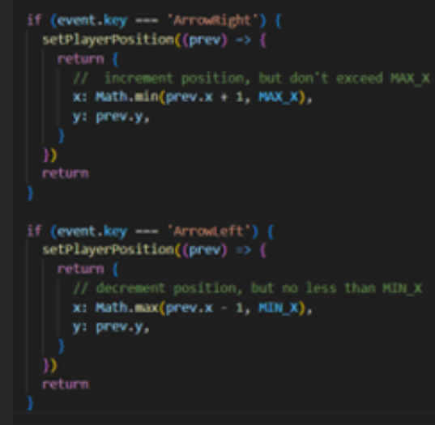

2. **Jumping mechanics**: 
   Here we have implemented a simple jump mechanic. When the user clicks the up-arrow key, the player is moved up 3 spaces then back down 3 spaces creating a jump action. 
   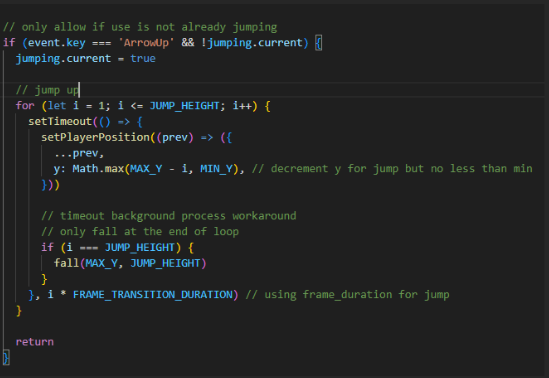 
   As mentioned above, we check to see if the user has pressed the up-arrow key and is not jumping. From here we decrement the player position y in a loop, as the top of the screen starts at 0 and the bottom of the screen where the player is, is equal to 8. From there we place the player back to its original y-axis by incrementing y in a loop.

3. **Coin collection**:
   we check if the player has the same location as the coin. We do this by checking the player’s position against the coin locations which is stored in our constants file as COIN_COLLISION. If it returns true we remove the coin from the view by returning null. 
   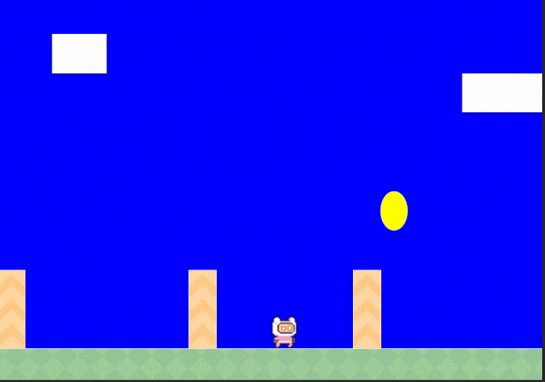
   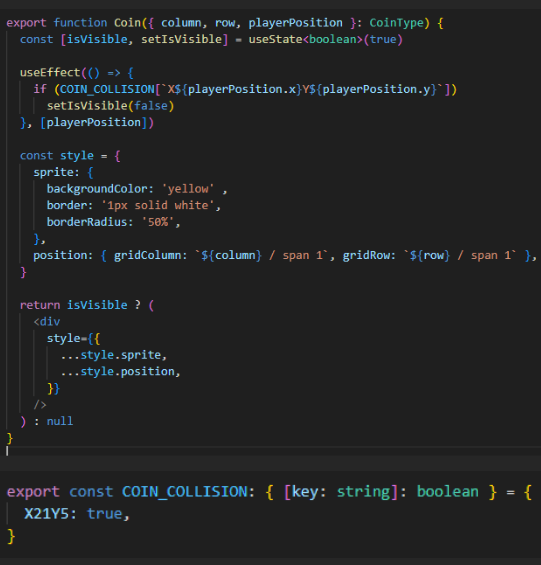

4. **Collision detection**:
   Similar to coin collection, collision detection uses position mapping as well to check if there is a pipe ahead or behind the play. This will prevent the player from moving. 
   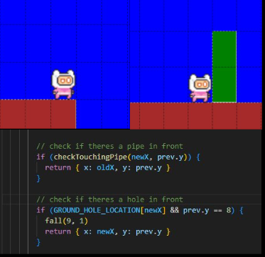
   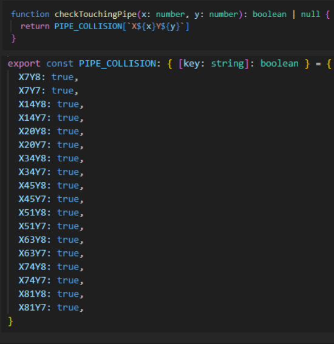 
   When the player is moving around we call a function called “checkTouchingPipe”. The function uses a simple conditional statement that returns true or false if the player position matches one of the pipe locations in our constants “PIPE_COLLISION” variable. If true we return the previous position of the player to prevent them from moving forward or back.

5. **Game over loss**:
   There are two ways for the game to end, in this case, it is a loss resulting in the game starting again. The condition for this is that the play must fall into a hole in the ground. While the player is moving, we check if the player is above a hole location if so we allow the player to fall by calling the fall function.  
   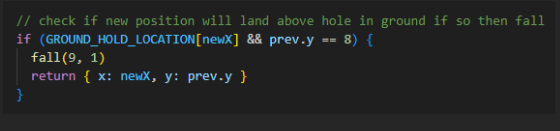 
   The “useEffect” callback function acts as an active listener, we use the player position y to listen for. If it is ever at the same row level as the hole we reset the game by reloading the page window creating an end game state.  
   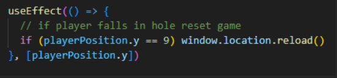

   6. **Game over win**:
       
      As mentioned above there are two ways to end game conditions in this case once the player reaches the end of the level where the castle is the game ends displaying a win message and a prompt giving the player the option to play again.
      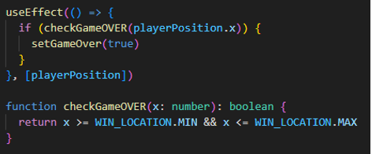
      Once again, we are using the “useEffect” callback function to actively listen and check the player's position x. If the player x x-axis is ever within the range of the win location which is the castle width, then we return true. Once the game over is true we toggle the view to display a game over win prompt as seen above.
