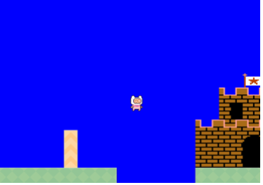

# 🎮 Side Scrolling Game Prototype

## 🧩 About

The primary objective is to develop a single-level side-scrolling game prototype inspired by classic Mario games using **pure React.js**, exploring the feasibility of modern web technologies in game development.

This project demonstrates core mechanics such as **player movement**, **camera scrolling**, **coin collection**, and **game over conditions**.

---

## 🛠️ Technologies

**CSS Grid**
Used to build the overall game layout.

**React.js**
Manages entities and game state logic.

Everything has a defined position — for example, the player starts at column 1, row 8, and the first pipe is located at column 7, row 8.

---

## ⭐ Key Features

- Player movement (jump and fall)
- Camera scroll
- Collision detection
- Coin collection
- Game over (win/lose)

---

## 🧍 Entities

---

## 🧱 Design and Architecture

As shown below, the game is structured into **three main layers**:

1. **Presentation Layer** – Handles rendering of all entities and visual elements.
2. **Entity Layer** – Manages game objects such as the player, coins, and pipes.
3. **Logic Controller Layer** – Handles player inputs and game logic.

> React’s design inherently couples the presentation and controller layers. While we aimed to separate them conceptually, some coupling remains due to React’s rendering model.

The game is developed using **React components** for entities, **custom hooks** for logic, and **CSS Grid** for spatial layout.

---

## 🎥 Camera Scroll Diagram

The camera scroll consists of three main components: the **camera**, the **overflowing x-axis**, and the **overflow** itself.

- **Camera:** The visible viewport where the player interacts with the game world.
- **Game Map:** The complete world grid containing all entities and terrain.
- **Overflow:** The mechanism that hides elements outside the camera area. The x-axis overflow is scrollable, allowing the camera to pan as the player moves.

---

## 🕹️ Output

### 1. Player Movement

The player’s position is mapped on a CSS grid.
Each movement forward or backward adds or subtracts one grid cell.

When a keypress event occurs, we check for left, right, or up arrow keys and update the player’s grid position accordingly.

---

### 2. Jumping Mechanics

A simple jump is implemented by moving the player **up 3 spaces**, then **back down 3 spaces**, creating a jump motion.

When the **up-arrow key** is pressed and the player isn’t already jumping, the player’s `y` position decreases (moves up) and then returns to the original value.

---

### 3. Coin Collection

The game checks if the player’s position matches any coin coordinates stored in the constants file (`COIN_COLLISION`).
When a collision is detected, the coin is removed from the view.

---

### 4. Collision Detection

Collision detection prevents movement when a pipe blocks the player’s path.
It uses the same position mapping technique as coin collection.

When moving, the function `checkTouchingPipe()` checks the player’s position against the constant `PIPE_COLLISION`.
If true, the player’s movement is cancelled.

---

### 5. Game Over – Loss

The game ends if the player falls into a hole.
While moving, the system checks if the player is above a hole location. If so, the **fall** function is triggered.

A `useEffect` listener monitors the player’s `y` position.
If it matches a hole’s row, the game resets by reloading the page.

---

### 6. Game Over – Win

The game ends with a **win** when the player reaches the castle at the end of the level.

A `useEffect` listener monitors the player’s `x` position.
When it falls within the castle’s range, the game toggles a win state and displays a success prompt.

---

## ✅ Summary

This prototype demonstrates that **React.js and CSS Grid** can effectively simulate 2D side-scrolling mechanics such as:

- Player movement
- Jumping
- Collision detection
- Camera scrolling
- Win/loss game states

Despite React’s inherent coupling between logic and presentation, this structure achieves clean modular separation using components, hooks, and constants — illustrating the **viability of web technologies for lightweight game development**.
